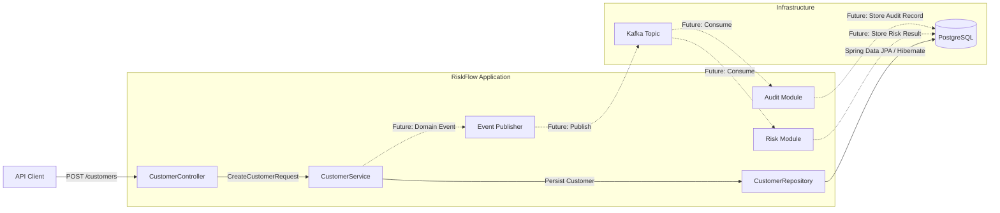

# RiskFlow

RiskFlow is a Kotlin and Spring Boot backend that models a customer risk lifecycle for a digital banking-style system.

The project starts as a modular monolith and evolves toward event-driven processing as new requirements justify it. The current implementation focuses on customer creation, persistence, validation, database migrations, and unit testing.

## Architecture



**Solid lines** represent the current synchronous flow.  
**Dashed lines** represent planned event-driven processing.

## Current Scope

The first vertical slice implements customer creation from HTTP request to PostgreSQL persistence.

Current capabilities:

- REST endpoint for customer creation
- Request validation
- UUID-based customer identifiers
- PostgreSQL persistence
- Spring Data JPA / Hibernate integration
- Flyway schema migrations
- Database constraints for required and unique fields
- Docker Compose for local PostgreSQL
- Unit tests with JUnit 5 and MockK
- Gradle Version Catalog for dependency versions

## Technology Stack

| Area | Technology |
| --- | --- |
| Language | Kotlin |
| Framework | Spring Boot |
| HTTP | Spring MVC |
| Persistence | Spring Data JPA, Hibernate |
| Database | PostgreSQL |
| Schema migrations | Flyway |
| Validation | Jakarta Bean Validation |
| Build | Gradle Kotlin DSL |
| Local infrastructure | Docker Compose |
| Testing | JUnit 5, MockK |

Planned additions will be introduced only when they solve a concrete requirement or reliability problem, including Kafka, Testcontainers, observability, retry handling, idempotency, and transactional outbox.

## Project Structure

The codebase is organized by business feature rather than by global technical layers.

```text
src/main/kotlin/com/riskflow
├── RiskFlowApplication.kt
└── customer
    ├── controller
    ├── dto
    ├── model
    ├── repository
    └── service
```

Future modules can be added alongside `customer`, for example:

```text
risk
review
audit
```

This keeps the application deployable as a single service while preserving clear module boundaries.

## Customer Creation Flow

```text
HTTP request
    ↓
CustomerController
    ↓
CustomerService
    ↓
CustomerRepository
    ↓
Spring Data JPA / Hibernate
    ↓
PostgreSQL
```

The API accepts customer-owned fields such as:

```json
{
  "firstName": "John",
  "lastName": "Doe",
  "email": "john.doe@example.com"
}
```

System-managed fields such as the customer ID and creation timestamp are generated as part of persistence and returned in the response.

## Database

Schema changes are versioned with Flyway under:

```text
src/main/resources/db/migration
```

The initial migration creates the `customers` table with:

- UUID primary key
- first name
- last name
- unique email address
- creation timestamp

Example migration:

```text
V1__create_customers_table.sql
```

Flyway owns schema evolution. Hibernate maps application entities to the existing schema and validates that the mappings are compatible.

## Testing

Run the test suite with:

```bash
./gradlew test
```

The current unit tests focus on the service layer and isolate persistence with MockK.

The testing strategy will expand in stages:

- unit tests for business logic
- repository integration tests with PostgreSQL
- API integration tests with Spring Boot
- Testcontainers for reproducible database tests

## Running Locally

### Requirements

- Java 25
- Docker
- Docker Compose

### Start PostgreSQL

```bash
docker compose up -d
```

### Run RiskFlow

```bash
./gradlew bootRun
```

The application starts on:

```text
http://localhost:8080
```

## Roadmap

Planned development areas:

- customer retrieval and error handling
- risk assessment and risk classification
- review workflow
- internal domain events
- Kafka-based asynchronous processing
- consumer groups, partitions, and offsets
- idempotent event handling
- retry and dead-letter handling
- transactional outbox
- optimistic locking
- observability and resilience
- service extraction only where justified

## Engineering Approach

RiskFlow is developed incrementally with a focus on:

- clear feature boundaries
- explicit database evolution
- simple, testable service design
- pragmatic use of Spring Boot and Kotlin
- production-style error handling
- event-driven architecture where it provides a clear benefit
- reliability patterns introduced in response to real failure scenarios
